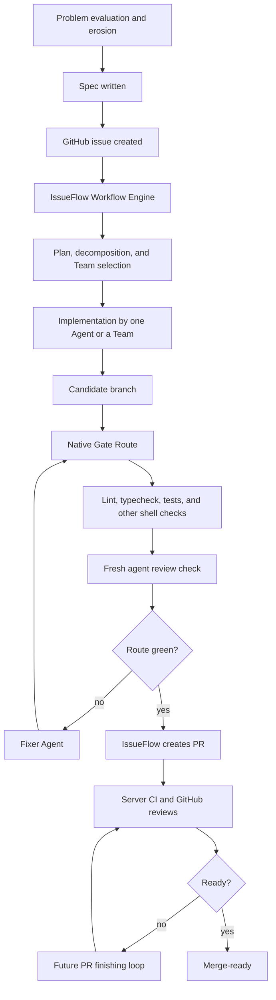

# Native Gate Route Design

## Context

IssueFlow is the Factory that turns GitHub issues into shipped pull requests through an explicit Workflow Engine. It already has the main control-plane pieces for the desired workflow: issue planning, Team execution, candidate branches, verification runs, Verification Gate verdicts, pull request creation, and merge readiness.

The missing piece is a deterministic pre-PR gate that can review, fail, fix, and rerun the whole route before IssueFlow creates a pull request. The design borrows the core FreeSolo idea: the route lives in code, not in an agent prompt. A red check cannot be argued with; it creates evidence, gives a Fixer Agent bounded context, and forces the whole route to run again.

## Goals

- Add a native IssueFlow Gate Route that runs before PR creation.
- Keep the route configurable at the repository level.
- Run shell checks, agent-backed review checks, and fixer loops deterministically.
- Preserve IssueFlow's Host and model agnosticism.
- Make the Workflow Engine, not any agent, the authority that decides whether a PR may be created.
- Produce structured evidence for each attempt, check, review, and fix.

## Non-Goals

- Do not shell out to the external `freesolo` CLI.
- Do not preserve backward compatibility with the old `verification.checks` config shape.
- Do not rename IssueFlow to FreeSolo in this change.
- Do not implement spec-to-GitHub-issue intake in this change.
- Do not implement the post-PR server CI and review-comment autofix loop in this change.

## User Workflow

The intended end-to-end workflow is:



This design covers the native Gate Route through PR creation. The future PR finishing loop can reuse the same route concepts, but it is a separate design.

## Architecture

### Gate Route Config

`issueflow.config.json` will define `verification.gateRoute`. The old `verification.checks` shape is no longer accepted.

Example:

```json
{
  "verification": {
    "gateRoute": {
      "maxAttempts": 3,
      "bail": true,
      "checks": [
        { "name": "build", "kind": "shell", "command": "npm", "args": ["run", "build"] },
        { "name": "test", "kind": "shell", "command": "npm", "args": ["test"], "timeoutSeconds": 900 },
        {
          "name": "review",
          "kind": "agent-review",
          "host": "codex",
          "promptPreset": "thermonuclear-review",
          "timeoutSeconds": 1800
        }
      ],
      "fixer": {
        "host": "codex",
        "promptPreset": "gate-fixer",
        "timeoutSeconds": 1800
      }
    }
  }
}
```

The route has:

- `maxAttempts`: total route attempts, including the first attempt.
- `bail`: whether a failing check stops the current attempt.
- `checks`: ordered route checks.
- `fixer`: the Agent task used when an attempt fails and more attempts remain.

Shell checks keep the existing command, args, cwd, and env model. Agent-backed checks use the existing Host/Adapter vocabulary, so the review check is not tied to Claude, Codex, Cursor, or Pi.

### Gate Route Runner

Add a new runner under `src/verification`, conceptually `route-runner.ts`.

Its loop is:

1. Start attempt 1.
2. Run every configured check in order.
3. If all checks pass, write a passing Gate Route run.
4. If a check fails and no attempts remain, write a failing Gate Route run.
5. If a check fails and attempts remain, build a structured Failure Context.
6. Start the configured Fixer Agent with that context.
7. If the Fixer Agent fails or times out, write a failing Gate Route run.
8. If the Fixer Agent succeeds, start the next attempt from the first check.

The invariant is that a fix never resumes from the failed check. A fix must prove it did not break earlier checks by rerunning the complete route.

### Agent-Backed Review Checks

The review check is a first-class check kind. It starts a fresh Agent process with:

- the issue number and candidate branch,
- the relevant spec or issue body when available,
- the candidate diff,
- ADRs and Knowledge Base entries,
- prior route logs for the current attempt,
- a strict instruction to report blocking correctness findings as failure and no blocking findings as pass.

The review check produces a review artifact and exits pass or fail. The exact prompt preset can be configured, with `thermonuclear-review` as the intended default preset once prompt presets exist.

### Fixer Agent

The Fixer Agent is started only after a failed attempt and only when another route attempt remains. It receives a structured Failure Context:

- failed check names,
- commands and exit codes,
- log paths and summaries,
- review findings when the failed check was an agent review,
- the current issue/spec context,
- the instruction not to edit the route config or unrelated code.

The Fixer Agent may change code. It does not declare success for the route. Success is determined only by the next complete route attempt.

### Gate Verdict and PR Creation

`issueflow gate evaluate` reads the latest Gate Route run record. It writes a pass verdict only if the latest route run passed. On pass, it transitions `verifying -> pr-ready`. On failure, it transitions `verifying -> implementing`.

`issueflow pr create` continues to require:

- issue state is `pr-ready`,
- gate verdict is pass,
- latest Gate Route run is pass,
- stored verdict run ID matches the latest run ID.

This keeps stale verdicts from allowing PR creation after new changes land.

## Evidence

Each Gate Route run writes structured evidence in the existing verification artifact area. The record should include:

- schema version,
- run ID,
- issue number,
- repo root,
- candidate branch,
- route config path,
- started and finished timestamps,
- final status,
- max attempts,
- attempts used,
- per-attempt check results,
- per-check log paths,
- review artifact paths,
- fixer invocation results and log paths.

The existing `TEST_REPORT.md` and `REVIEW_REPORT.md` concepts can remain, but the route run record is the authoritative machine-readable evidence for the Verification Gate.

## Error Handling

- Missing or invalid `verification.gateRoute` is a config error and exits with code 2.
- A shell check non-zero exit marks that check failed.
- A shell check timeout marks that check failed.
- An agent review failure marks that check failed.
- A Fixer Agent non-zero exit or timeout marks the route failed immediately.
- If `bail` is true, the current attempt stops at the first failing check.
- If `bail` is false, later checks still run and contribute to the Failure Context.
- After `maxAttempts`, the run remains failed and PR creation is blocked.
- The Workflow Engine remains the only authority that can transition through the Verification Gate.

## Testing Strategy

Add focused tests for:

- config schema validation for `verification.gateRoute`,
- rejecting the old `verification.checks` shape,
- shell check pass/fail behavior,
- attempt counting and max-attempt failure,
- complete rerun after a successful fix,
- bail true and bail false behavior,
- Fixer Agent failure and timeout behavior,
- agent review check pass/fail behavior with fake adapters,
- Gate command behavior for pass and fail route runs,
- PR command stale-verdict blocking,
- an integration path from `implementing` through `verifying` to `pr-ready` using fake checks and a fake Fixer Agent.

## Open Follow-Up Work

- Design the post-PR watch loop that waits for server CI and GitHub review comments.
- Reuse the Fixer Agent model to address PR comments and rerun server checks until ready.
- Add spec-to-issue intake before IssueFlow starts implementation.
- Consider the later product rename from IssueFlow to FreeSolo after the native route exists.
